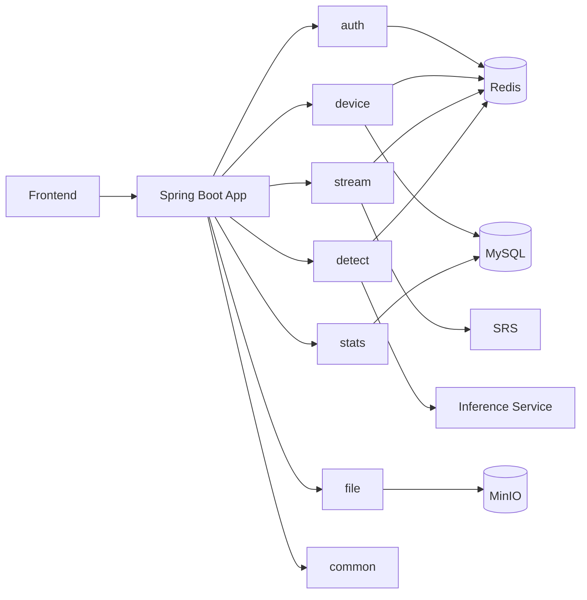

# AerialEye 后端工程化设计报告

> 版本快照：2026-04-07  
> 代码基线：当前工作区（多模块 Maven 单体）

## 1. 执行摘要

AerialEye 当前采用“单体部署 + 领域模块化”后端架构，围绕无人机多通道视频检测场景，已形成从认证、设备接入、流媒体会话、模型推理编排、结果实时分发到统计沉淀的完整闭环。核心设计取向是：先保证业务闭环和迭代速度，再通过 Redis/Event/异步化补齐并发和可运维性。

系统已经具备可演示级后端能力：

- 支持账号体系、RBAC、风控与审计。
- 支持设备双通道（RGB/IR）绑定、路由与在线状态管理。
- 支持实时流/离线视频推理会话，支持双视频拼接。
- 支持 WebSocket 实时结果推送（本地/Redis 广播两种模式）。
- 支持检测结果入库并提供统计分析接口。

## 2. 架构总览

### 2.1 架构风格

- 架构类型：模块化单体（Modular Monolith）
- 技术栈：Java 21 + Spring Boot 3.4 + MyBatis + Redis + MinIO + Sa-Token
- 部署形态：`app` 聚合打包单 JAR / Docker

### 2.2 模块职责

| 模块     | 核心职责                               | 关键特征                      |
| -------- | -------------------------------------- | ----------------------------- |
| `app`    | 启动聚合、全局配置                     | 统一扫描、CORS、调度/异步开关 |
| `common` | 统一结果、异常、事件、工具             | 统一错误码与响应协议          |
| `auth`   | 登录注册、刷新、RBAC、审计、WS票据     | Sa-Token + Redis Token体系    |
| `device` | 设备/通道管理、绑定流程、流路由        | 双通道绑定、在线租约管理      |
| `stream` | SRS回调接入、流会话、结果广播          | 合流进程编排、WS网关          |
| `detect` | 推理会话状态机、模型命令下发、结果回调 | Redis状态存储、异步推理管线   |
| `file`   | MinIO上传/播放URL、临时资源回收        | token生命周期关联清理         |
| `stats`  | 检测与登录统计聚合查询                 | 事件驱动落库 + 日粒度汇总     |

### 2.3 逻辑架构图

## 3. 关键后端方案

### 3.1 认证与安全方案

1. 双令牌模型：`accessToken(Sa-Token)` + `refreshToken(Redis哈希存储)`，支持 remember-me TTL 分层。
2. 单会话策略：登录时主动踢下线旧会话并撤销旧 refresh token。
3. 主动失效策略：退出/刷新/改角色时将 access token 拉入黑名单，配合本地短 TTL 缓存减少 Redis 压力。
4. 风控策略：
   - 登录失败按账号/IP双维度计数与锁定。
   - 邮箱验证码发送频控 + 校验失败锁定。
   - 密码策略强校验（长度+大小写+数字+特殊字符）。
5. RBAC 策略：角色与权限查询走 DB，结果按用户维度缓存到 Redis（含空值缓存），变更时主动失效。
6. 安全审计：登录/登出/刷新/重置密码等事件异步写审计表，采用独立线程池与新事务边界。

### 3.2 设备与通道方案

1. 设备模型：`drone_device` + `device_channel` + `device_member` 三表建模，支持 OWNER/EDITOR/VIEWER 权限分层。
2. 双通道建模：通道类型显式区分 RGB/IR，面向后续融合推理。
3. 两阶段绑定：
   - 阶段1：生成 `bindId` 和临时推流路由（Redis）。
   - 阶段2：接收 SRS 发布回调后补全 RGB/IR，再原子落库生成正式设备和通道。
4. 在线状态策略：Redis 心跳键 + 在线租约键 + 客户端ID键，多信号融合判定在线状态，兼顾实时性与容错。

### 3.3 流媒体与推理会话方案

1. 会话编排：
   - 实时流会话：按设备解析 RGB/IR，先合流再触发模型会话。
   - 视频会话：支持单视频或 RGB/IR 双视频拼接后推理。
2. 合流策略：FFmpeg 物理拼接（左右布局），并对同一对 RGB/IR 使用进程复用+引用计数，降低重复开销。
3. 路由并发控制：Redis 路由锁 + compare-and-delete Lua，避免并发 start/stop 竞争。
4. 状态存储：视频/流会话快照存 Redis Hash，状态机为 `STARTING/RUNNING/STOPPING/STOPPED`。
5. 回调处理：模型结果回调先做 token 与会话有效性校验，再分发到实时通道并触发统计事件。

### 3.4 实时推送方案（WebSocket）

1. 鉴权：通过一次性 WS Ticket（Redis `getAndDelete`）握手认证，避免长期凭证暴露。
2. 订阅模型：客户端按 `detectSessionId` 订阅，网关按会话路由定向推送。
3. 广播模式：
   - `local`：单实例进程内广播。
   - `redis`：跨实例 Pub/Sub 广播。
4. 设备上下线事件：SRS 回调触发设备在线状态消息，按设备可读用户集合定向通知。

### 3.5 文件与资源生命周期方案

1. 上传落地：视频上传 MinIO，返回可播放地址（可重写为 public endpoint）。
2. 生命周期绑定：上传对象与当前 access token 关联登记。
3. 回收策略：
   - 用户登出事件或 token 到期触发清理。
   - 采用 ZSet 定时扫描 + 批量回收 + 失败重试。
4. 安全删除：支持业务引用检查器链（当前含检测会话引用检查），防止误删在用对象。

### 3.6 统计方案

1. 数据入口：检测结果通过 Spring Event 异步消费落库。
2. 双层存储：
   - 明细层：`stats_detect_event` 保留事件级记录。
   - 汇总层：`stats_daily_device` 日粒度 UPSERT 累加，支持快速查询。
3. 查询策略：根据是否管理员切换查询范围（全局/个人可见设备），支持概览、趋势、TopN。

## 4. 工程化策略评估

### 4.1 已形成的工程化能力

- 明确模块边界与职责，依赖方向清晰。
- 错误码、响应体、异常处理统一。
- 核心链路大量使用 Redis 做状态与限流/锁。
- 关键耗时路径异步化（审计写入、统计写入、推理处理）。
- 具备基础可观测性：Actuator + Prometheus + Micrometer 指标。
- 容器化部署脚本与生产 profile 已具备。

AerialEye 后端已具备较完整的“设备接入 -> 推理编排 -> 实时分发 -> 统计沉淀”工程链路，架构选择务实，模块职责清晰，策略设计覆盖了安全、并发和运维的核心面。

